<div align="center">


<br/>

```
  ██████╗ ███████╗██╗   ██╗    ███████╗████████╗ █████╗  ██████╗██╗  ██╗
  ██╔══██╗██╔════╝██║   ██║    ██╔════╝╚══██╔══╝██╔══██╗██╔════╝██║ ██╔╝
  ██║  ██║█████╗  ██║   ██║    ███████╗   ██║   ███████║██║     █████╔╝
  ██║  ██║██╔══╝  ╚██╗ ██╔╝    ╚════██║   ██║   ██╔══██║██║     ██╔═██╗
  ██████╔╝███████╗ ╚████╔╝     ███████║   ██║   ██║  ██║╚██████╗██║  ██╗
  ╚═════╝ ╚══════╝  ╚═══╝      ╚══════╝   ╚═╝   ╚═╝  ╚═╝ ╚═════╝╚═╝  ╚═╝
```

### `Md. Ashikur Rahman` · Full-Stack & Mobile Engineer

<p>
  
</p>

<p>
  <a href="https://github.com/Ashik55?tab=followers">
    
  </a>
  &nbsp;
  <a href="https://github.com/Ashik55">
    
  </a>
  &nbsp;
  <a href="https://github.com/Ashik55?tab=repositories">
    
  </a>
  &nbsp;
  <a href="https://www.linkedin.com/in/md-ashikur-rahman-cse/">
    
  </a>
  &nbsp;
  <a href="https://stackoverflow.com/users/9816845/md-ashikur-rahman">
    
  </a>
  &nbsp;
  
</p>

</div>

---

<div align="center">

`About` • `Tech Stack` • `Analytics` • `Projects` • `Contact`

</div>

---

<table width="100%">
<tr>
<td width="50%" valign="top">

### 👨‍💻 &nbsp;About Me

```yaml
name: Md. Ashikur Rahman
location: Dhaka, Bangladesh 🇧🇩
company: Parallaxlogic Infotech
role: Full-Stack & Mobile Engineer

focus:
  - SaaS dashboards & admin panels
  - AI workflow tools & automation
  - Cross-platform mobile apps
  - Open-source UI kits & starters

currently_building:
  - Next.js SaaS platforms
  - Flutter & React Native apps
  - Developer tooling & automation
```

</td>
<td width="50%" valign="top">

### 🎯 &nbsp;Quick Stats

```
Public Repos     →  Auto-updated badge above
Core Languages   →  TypeScript · Dart · Kotlin · Swift
Stack            →  Full-Stack + Mobile
Open Source      →  Yes ✓
Available for    →  Collabs & Contracts
```

<br/>

> _"Great software is built one thoughtful commit at a time."_

<br/>

📬 **Reach me at** → [LinkedIn](https://www.linkedin.com/in/md-ashikur-rahman-cse/) · [GitHub](https://github.com/Ashik55) · [Stack Overflow](https://stackoverflow.com/users/9816845/md-ashikur-rahman)

</td>
</tr>
</table>

---

## 🛠 &nbsp;Technology Arsenal

<details open>
<summary><b>🌐 &nbsp;Web & Backend</b></summary>

<br/>

| Layer          | Technologies                                                                                                                                                                                                                                                                                                    |
| -------------- | --------------------------------------------------------------------------------------------------------------------------------------------------------------------------------------------------------------------------------------------------------------------------------------------------------------- |
| **Frameworks** |  &nbsp;  &nbsp;  |
| **Languages**  |  &nbsp;                                                                         |
| **Styling**    |  &nbsp;                                                                      |
| **Database**   |  &nbsp;                                                                                                      |
| **DevOps**     |  &nbsp;                                                                          |

</details>

<details open>
<summary><b>📱 &nbsp;Mobile</b></summary>

<br/>

| Platform           | Technologies                                                                                                                                                                                                                   |
| ------------------ | ------------------------------------------------------------------------------------------------------------------------------------------------------------------------------------------------------------------------------ |
| **Cross-Platform** |  &nbsp;  |
| **iOS**            |  &nbsp;                  |
| **Android**        |  &nbsp;             |

</details>

---

## 📊 &nbsp;GitHub Analytics

<div align="center">


&nbsp;&nbsp;


<br/><br/>



<br/><br/>


<br/><br/>


</div>

---

## 🐍 &nbsp;Contribution Snake

<div align="center">
<picture>
  <source media="(prefers-color-scheme: dark)" srcset="https://raw.githubusercontent.com/Ashik55/Ashik55/output/github-contribution-grid-snake-dark.svg">
  <source media="(prefers-color-scheme: light)" srcset="https://raw.githubusercontent.com/Ashik55/Ashik55/output/github-contribution-grid-snake.svg">
  
</picture>
</div>

---

## 🚀 &nbsp;Featured Projects

<div align="center">

<table>
<tr>
<td align="center" width="50%">

### 🍞 &nbsp;[breadit](https://github.com/Ashik55/breadit)

`Next.js` &nbsp; `TypeScript` &nbsp; `Full-Stack`

A modern, full-featured Reddit clone built with Next.js 13 App Router, TypeScript, Prisma, and Tailwind CSS. Production-grade architecture with real-time feeds and authentication.

</td>
<td align="center" width="50%">

### 🚀 &nbsp;[launch-ui](https://github.com/Ashik55/launch-ui)

`React` &nbsp; `Tailwind` &nbsp; `shadcn/ui`

A beautiful landing page component kit. Copy, paste, and ship. Built with shadcn/ui and Tailwind CSS — production-ready components for modern SaaS.

</td>
</tr>
<tr>
<td align="center" width="50%">

### 🏪 &nbsp;[b2b-starter-medusa](https://github.com/Ashik55/b2b-starter-medusa)

`Medusa` &nbsp; `E-commerce` &nbsp; `B2B`

A powerful B2B e-commerce starter template powered by Medusa. Built for teams that need flexible, open-source commerce infrastructure.

</td>
<td align="center" width="50%">

### 🔮 &nbsp;[encipher-x-ios](https://github.com/Ashik55/encipher-x-ios)

`Swift` &nbsp; `SwiftUI` &nbsp; `Matrix`

A next-generation Matrix protocol client for iOS. Sleek, modern UI built in SwiftUI with end-to-end encrypted messaging.

</td>
</tr>
<tr>
<td align="center" width="50%">

### 💬 &nbsp;[whatsapp-clone-react-native](https://github.com/Ashik55/whatsapp-clone-react-native)

`React Native` &nbsp; `Mobile`

A pixel-perfect WhatsApp-style chat clone built with React Native. Real-time messaging UI with all the familiar UX patterns.

</td>
<td align="center" width="50%">

### 🌐 &nbsp;[react-native-live-translator](https://github.com/Ashik55/react-native-live-translator)

`React Native` &nbsp; `AI` &nbsp; `Mobile`

Real-time translation app built with React Native. Break language barriers on the go with a fast, elegant mobile experience.

</td>
</tr>
<tr>
<td align="center" width="50%">

### 🎨 &nbsp;[shadcn-studio](https://github.com/Ashik55/shadcn-studio)

`shadcn/ui` &nbsp; `Components`

A curated studio of copy-paste shadcn/ui components, blocks, and templates. Accelerate your next project with production-ready UI.

</td>
<td align="center" width="50%">

### 🏗 &nbsp;[create-t3-turbo](https://github.com/Ashik55/create-t3-turbo)

`T3 Stack` &nbsp; `Expo` &nbsp; `Monorepo`

Full-stack monorepo template with Next.js + React Native (Expo). Share code across web and mobile with the T3 stack.

</td>
</tr>
</table>

</div>

<p align="center">
  <a href="https://github.com/Ashik55?tab=repositories">
    
  </a>
</p>

---

## 💡 &nbsp;Currently Shipping

```
┌─────────────────────────────────────────────────────────────────────────┐
│                        WHAT I'M BUILDING NOW                           │
├─────────────────────────────────────────────────────────────────────────┤
│                                                                         │
│  🖥  SaaS Dashboards & Admin Panels  ──────  Next.js + TypeScript       │
│  🤖  AI Workflow Tools & Dev Automation  ──  Python + Scripting         │
│  📱  Cross-Platform Mobile Apps  ──────────  Flutter & React Native     │
│  🎨  Open-Source UI Kits & Starters  ──────  shadcn/ui + Tailwind       │
│                                                                         │
└─────────────────────────────────────────────────────────────────────────┘
```

---

<div align="center">

### 📫 &nbsp;Let's Connect

<a href="https://github.com/Ashik55"></a>
&nbsp;
<a href="https://www.linkedin.com/in/md-ashikur-rahman-cse/"></a>
&nbsp;
<a href="https://stackoverflow.com/users/9816845/md-ashikur-rahman"></a>

<br/><br/>


<br/>


</div>
